<p align="center">
  
</p>

<div align="center">

⏬[**Download Models**](#-download-models) **|** 💻[**How to Test**](#-how-to-test) **|** 💥 [](https://huggingface.co/spaces/ChongMou/T2I-Adapter)

🏰[**Adapter Zoo**](docs/AdapterZoo.md)
</div>

<div align="center">
<p align="center">
  

  *T2I adapters naturally support using multiple adapters together.*<br />
  *The running command is [here](docs/examples.md/#-multi-adapters)*<br />
  *[Image source](https://twitter.com/toyxyz3/status/1628375164781211648)*
</p>

</div>

🚩 **New Features/Updates**

- ✅ Feb. 23, 2023. Add the depth adapter [*t2iadapter_depth_sd14v1.pth*](https://huggingface.co/TencentARC/T2I-Adapter/tree/main/models). See more info in the **[Adapter Zoo](docs/AdapterZoo.md)**.

Official implementation of **[T2I-Adapter: Learning Adapters to Dig out More Controllable Ability for Text-to-Image Diffusion Models](https://arxiv.org/abs/2302.08453)**.

<p align="center">
  
</p>

We propose T2I-Adapter, a **simple and small (~70M parameters, ~300M storage space)** network that can provide extra guidance to pre-trained text-to-image models while **freezing** the original large text-to-image models.

T2I-Adapter aligns internal knowledge in T2I models with external control signals.
We can train various adapters according to different conditions, and achieve rich control and editing effects.

<p align="center">
  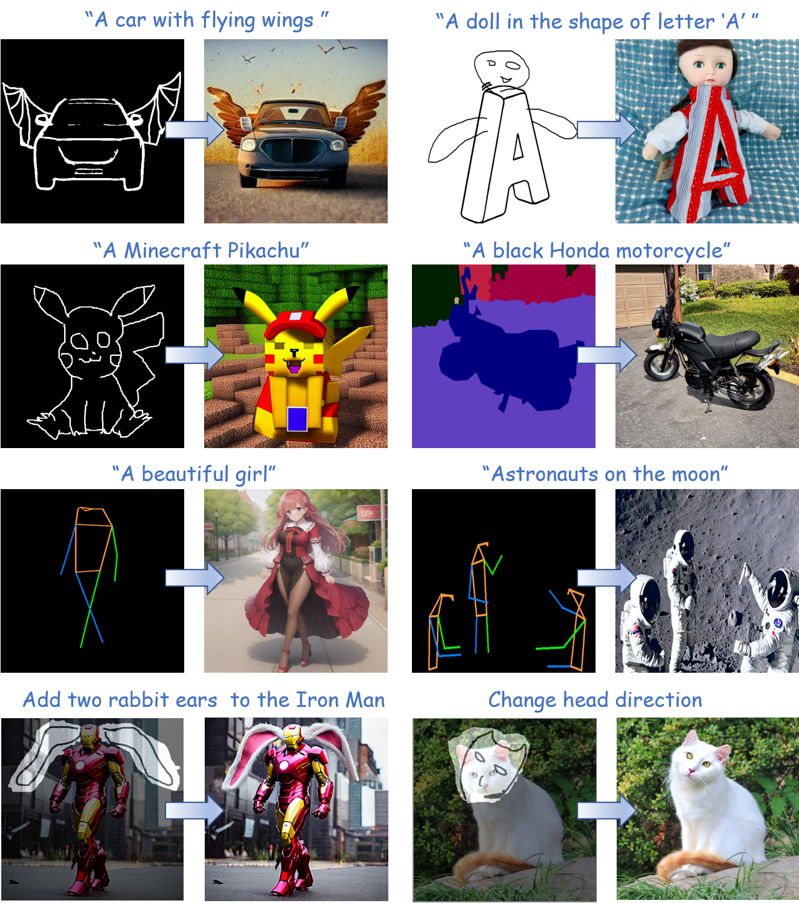
</p>

### ⏬ Download Models

Put the downloaded models in the `T2I-Adapter/models` folder.

1. The pretrained **T2I-Adapters** can be downloaded from <https://huggingface.co/TencentARC/T2I-Adapter>.
2. The pretrained **Stable Diffusion v1.4** models can be download from <https://huggingface.co/CompVis/stable-diffusion-v-1-4-original/tree/main>. You need to download the `sd-v1-4.ckpt
` file.
3. [Optional] The current adapters are trained based on SD-V1.4, but it also works well on other SD models which are finetuned from SD-V1.4 or SD-V1.5. You can download these models from HuggingFace or civitai, all the following tested models (e.g., Anything anime model) can be found in there.
4. The pretrained keypose detection models include FasterRCNN (human detection) from <https://download.openmmlab.com/mmdetection/v2.0/faster_rcnn/faster_rcnn_r50_fpn_1x_coco/faster_rcnn_r50_fpn_1x_coco_20200130-047c8118.pth> and HRNet (pose detection) from <https://download.openmmlab.com/mmpose/top_down/hrnet/hrnet_w48_coco_256x192-b9e0b3ab_20200708.pth>.


### 🔧 Dependencies and Installation

- Python >= 3.6 (Recommend to use [Anaconda](https://www.anaconda.com/download/#linux) or [Miniconda](https://docs.conda.io/en/latest/miniconda.html))
- [PyTorch >= 1.4](https://pytorch.org/)
```bash
pip install -r requirements.txt
```
- If you want to use the full function of keypose-guided generation, you need to install MMPose. For details please refer to <https://github.com/open-mmlab/mmpose>.

### 💻 How to Test

[//]: # (#### **Gradio Application**)

[//]: # ()
[//]: # (> python app.py)

#### **Depth Adapter**
```bash
# when input non-depth image
python test_adapter.py --which_cond depth --cond_path examples/depth/sd.png --cond_inp_type image --prompt "Stormtrooper's lecture, best quality, extremely detailed" --sd_ckpt models/v1-5-pruned-emaonly.ckpt --resize_short_edge 512 --cond_tau 1.0 --cond_weight 1.0 --n_samples 2 --adapter_ckpt models/t2iadapter_depth_sd14v1.pth
# when input depth image
python test_adapter.py --which_cond depth --cond_path examples/depth/desk_depth.png --cond_inp_type depth --prompt "desk, best quality, extremely detailed" --sd_ckpt models/v1-5-pruned-emaonly.ckpt --resize_short_edge 512 --cond_tau 1.0 --cond_weight 1.0 --n_samples 2 --adapter_ckpt models/t2iadapter_depth_sd14v1.pth
```
[](https://huggingface.co/spaces/ChongMou/T2I-Adapter)
<p align="center">
  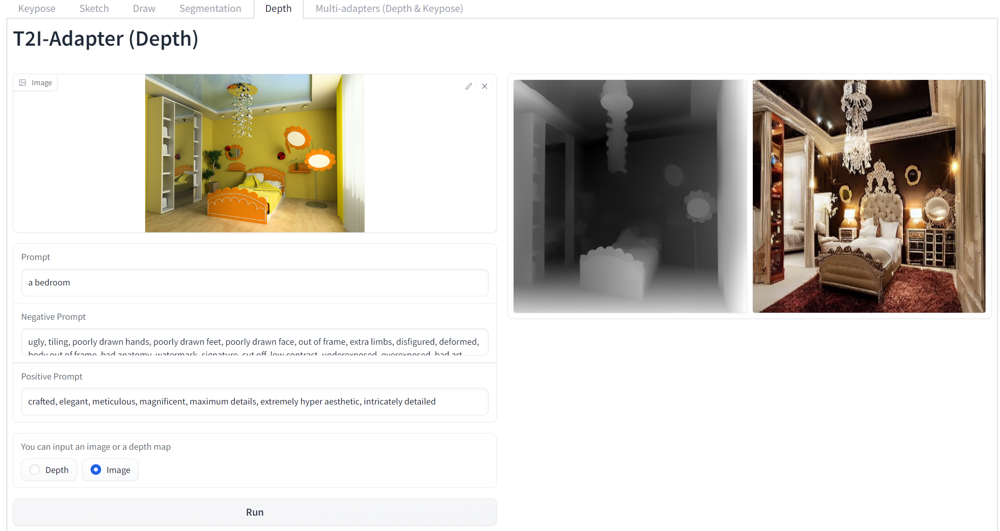
</p>


#### **Sketch Adapter**
```bash
# when input sketch image
python test_adapter.py --which_cond sketch --cond_path examples/sketch/car.png --cond_inp_type sketch --prompt "A car with flying wings" --sd_ckpt models/sd-v1-4.ckpt --resize_short_edge 512 --cond_tau 0.5 --cond_weight 1.0 --n_samples 2 --adapter_ckpt models/t2iadapter_sketch_sd14v1.pth
# when input non-sketch image
python test_adapter.py --which_cond sketch --cond_path examples/sketch/girl.jpeg --cond_inp_type image --prompt "1girl, masterpiece, high-quality, high-res" --sd_ckpt models/anything-v4.5-pruned-fp16.ckpt --vae_ckpt models/anything-v4.0.vae.pt --resize_short_edge 512 --cond_tau 1.0 --cond_weight 1.0 --n_samples 2 --adapter_ckpt models/t2iadapter_sketch_sd14v1.pth
```

[](https://huggingface.co/spaces/ChongMou/T2I-Adapter)
<p align="center">
  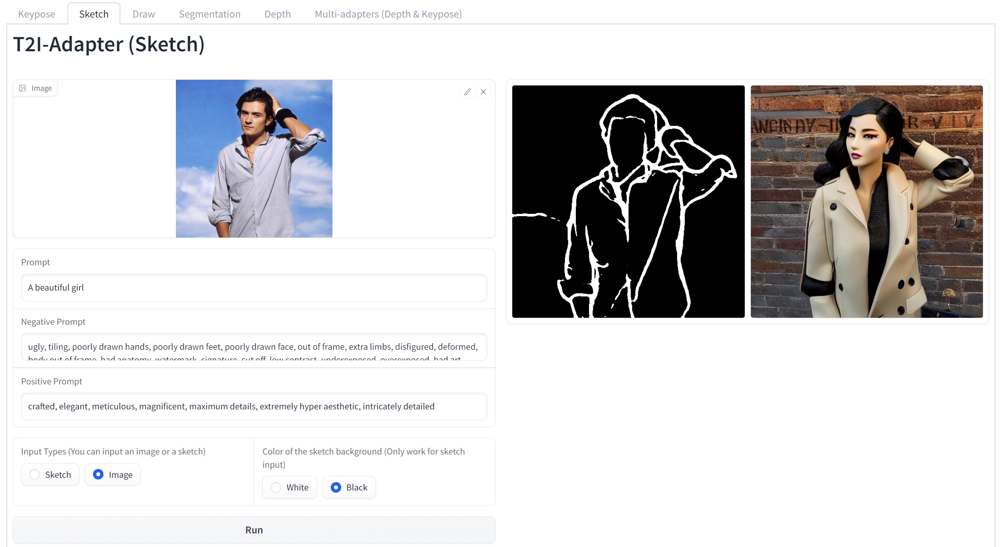
</p>

<p align="center">
  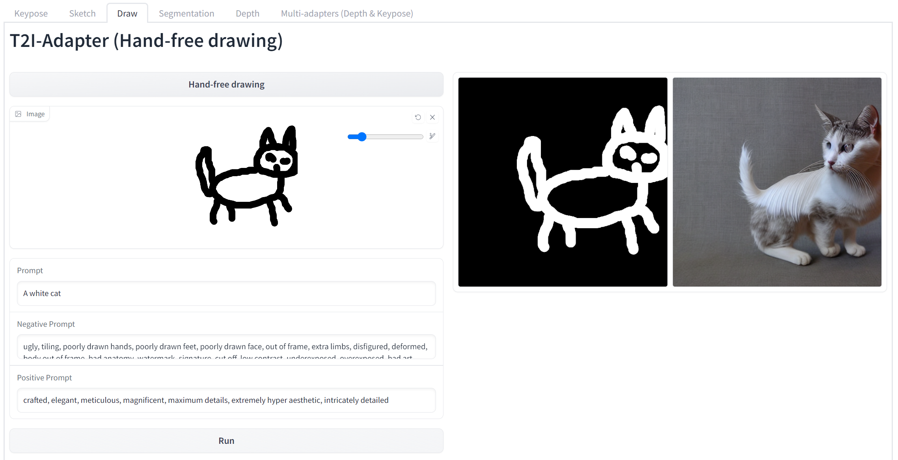
</p>

#### **Keypose Adapter**
```bash
# when input non-pose image
python test_adapter.py --which_cond keypose --cond_path examples/sketch/girl.jpeg --cond_inp_type image --prompt "1girl, masterpiece, high-quality, high-res" --sd_ckpt models/anything-v4.5-pruned-fp16.ckpt --vae_ckpt models/anything-v4.0.vae.pt --resize_short_edge 512 --cond_tau 1.0 --cond_weight 1.0 --n_samples 1 --adapter_ckpt models/t2iadapter_keypose_sd14v1.pth
# when input pose image
python test_adapter.py --which_cond keypose --cond_path examples/keypose/person_keypose.png --cond_inp_type keypose --prompt "astronaut, best quality, extremely detailed" --sd_ckpt models/v1-5-pruned-emaonly.ckpt --resize_short_edge 512 --cond_tau 1.0 --cond_weight 1.0 --n_samples 2 --adapter_ckpt models/t2iadapter_keypose_sd14v1.pth
```

[](https://huggingface.co/spaces/ChongMou/T2I-Adapter)
<p align="center">
  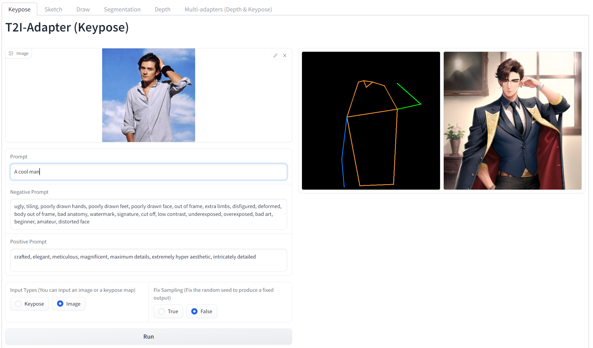
</p>


#### **Segmentation Adapter**
```bash
# currently, only seg input is supported, if you need image as input, please let us know
python test_adapter.py --which_cond seg --cond_path examples/seg/motor.png --cond_inp_type seg --prompt "A black Honda motorcycle parked in front of a garage, best quality, extremely detailed" --sd_ckpt models/v1-5-pruned-emaonly.ckpt --resize_short_edge 512 --cond_tau 1.0 --cond_weight 1.0 --n_samples 2 --adapter_ckpt models/t2iadapter_seg_sd14v1.pth
```

[](https://huggingface.co/spaces/ChongMou/T2I-Adapter)
<p align="center">
  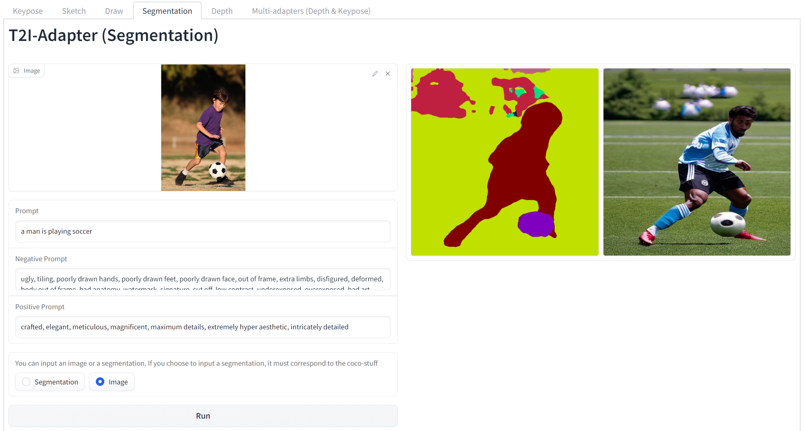
</p>

#### **Combine multiple Adapters**
```bash
# test depth + keypose
python test_composable_adapters.py --prompt "1girl, computer desk, red chair best quality, extremely detailed" --depth_path examples/depth/desk_depth.png --depth_weight 1.0 --depth_adapter_ckpt experiments/train_depth/models/model_ad_70000.pth --depth_inp_type depth --keypose_path examples/keypose/person_keypose.png --keypose_inp_type keypose --keypose_adapter_ckpt models/t2iadapter_keypose_sd14v1.pth --keypose_weight 1.5 --cond_tau 0.7 --sd_ckpt models/anything-v4.5-pruned-fp16.ckpt --vae_ckpt models/anything-v4.0.vae.pt --n_sample 8 --max_resolution 524288
```
[](https://huggingface.co/spaces/ChongMou/T2I-Adapter)
<p align="center">
  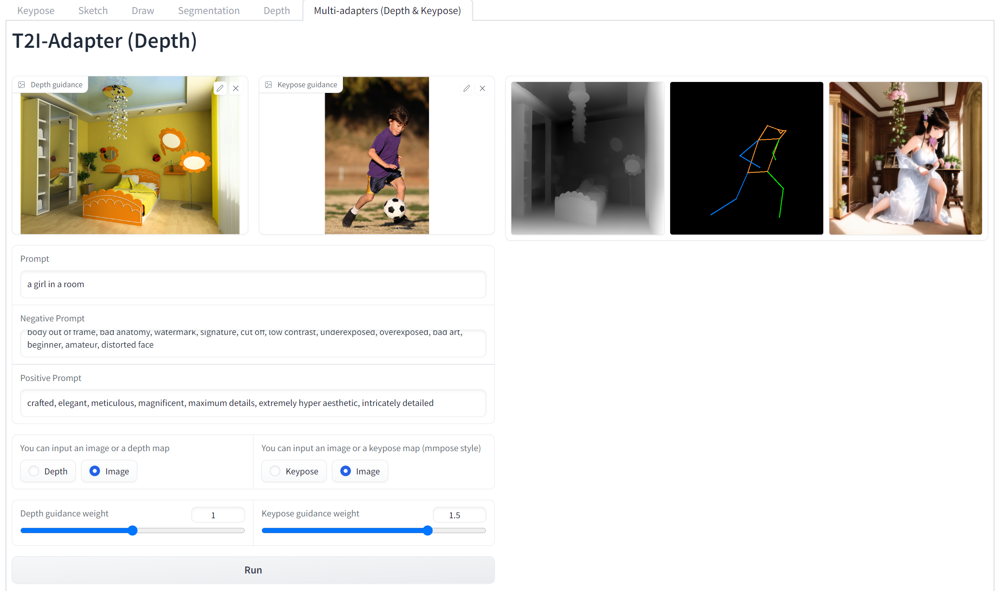
</p>


## Stable Diffusion + T2I-Adapters (only ~70M parameters, ~300M storage space)

The following is the detailed structure of a **Stable Diffusion** model with the **T2I-Adapter**.
<p align="center">
  
</p>

<!-- ## Web Demo

* All the usage of three T2I-Adapters (i.e, sketch, keypose and segmentation) are integrated into [Huggingface Spaces]() 🤗 using [Gradio](). Have fun with the Web Demo.  -->

## 🚀 Interesting Applications

### Stable Diffusion results guided with the sketch T2I-Adapter

The corresponding edge maps are predicted by PiDiNet. The sketch T2I-Adapter can well generalize to other similar sketch types, for example, sketches from the Internet and user scribbles.

<p align="center">
  
</p>

### Stable Diffusion results guided with the keypose T2I-Adapter

The keypose results predicted by the [MMPose](https://github.com/open-mmlab/mmpose).
With the keypose guidance, the keypose T2I-Adapter can also help to generate animals with the same keypose, for example, pandas and tigers.

<p align="center">
  
</p>

### T2I-Adapter with Anything-v4.0

Once the T2I-Adapter is trained, it can act as a **plug-and-play module** and can be seamlessly integrated into the finetuned diffusion models **without re-training**, for example, Anything-4.0.

#### ✨ Anything results with the plug-and-play sketch T2I-Adapter (no extra training)

<p align="center">
  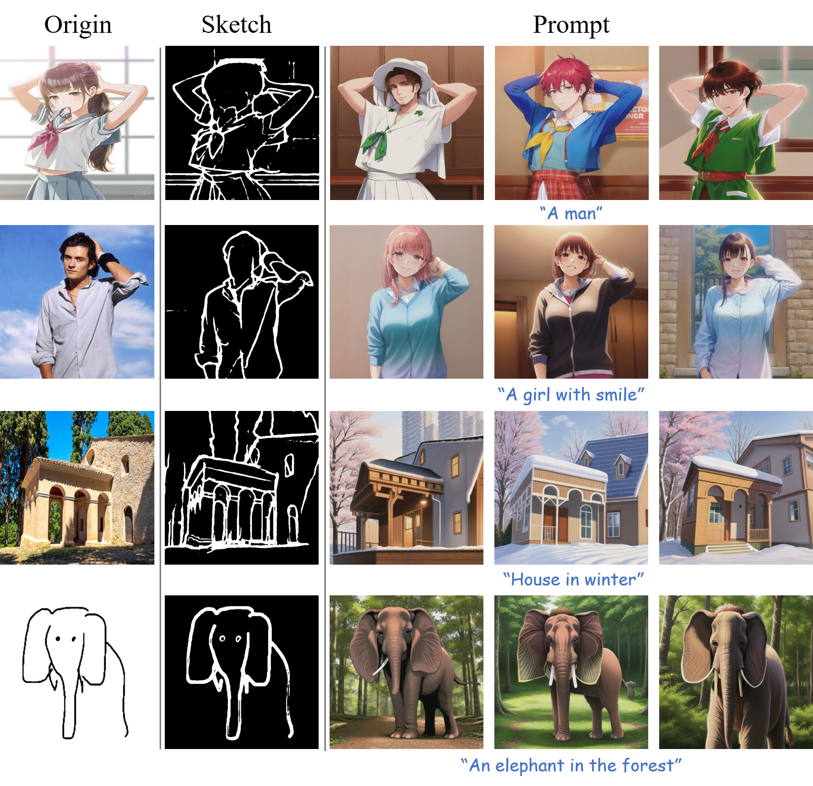
</p>

#### Anything results with the plug-and-play keypose T2I-Adapter (no extra training)

<p align="center">
  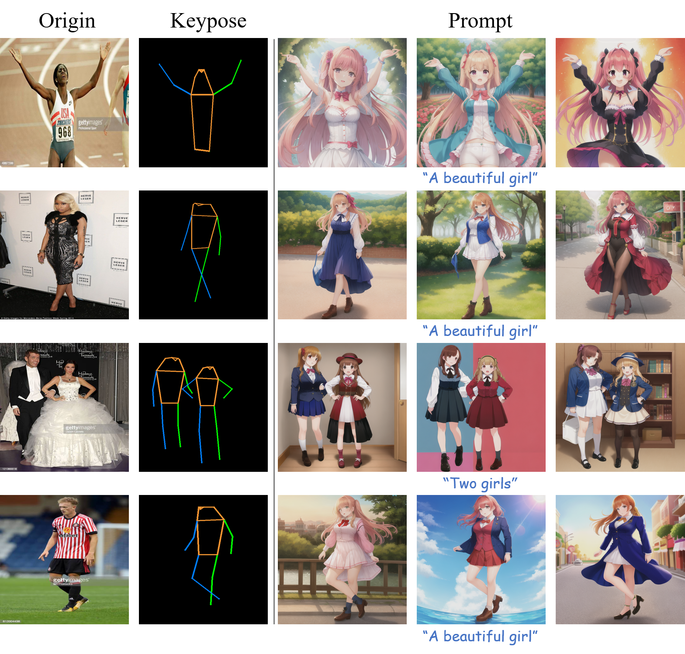
</p>

### Local editing with the sketch adapter

When combined with the inpaiting mode of Stable Diffusion, we can realize local editing with user specific guidance.

#### ✨ Change the head direction of the cat

<p align="center">
  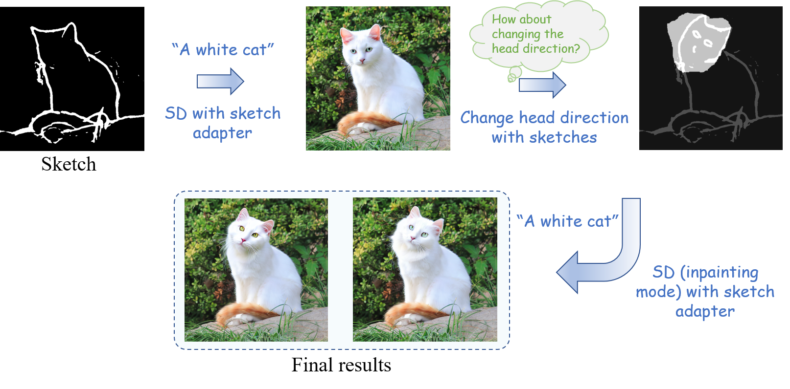
</p>

#### ✨ Add rabbit ears on the head of the Iron Man.

<p align="center">
  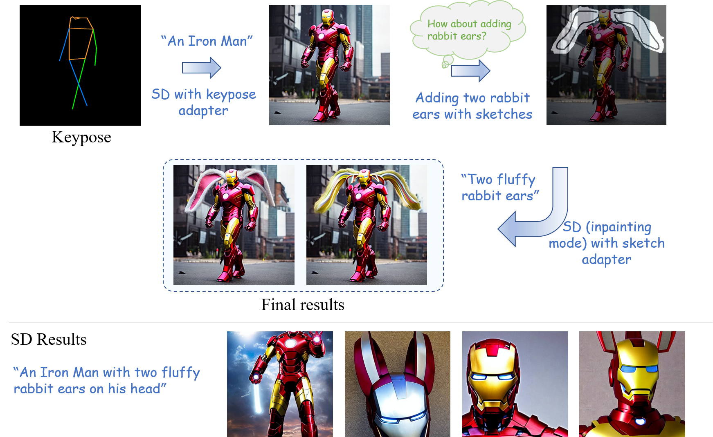
</p>

### Combine different concepts with adapter

Adapter can be used to enhance the SD ability to combine different concepts.

####  ✨ A car with flying wings. / A doll in the shape of letter ‘A’.

<p align="center">
  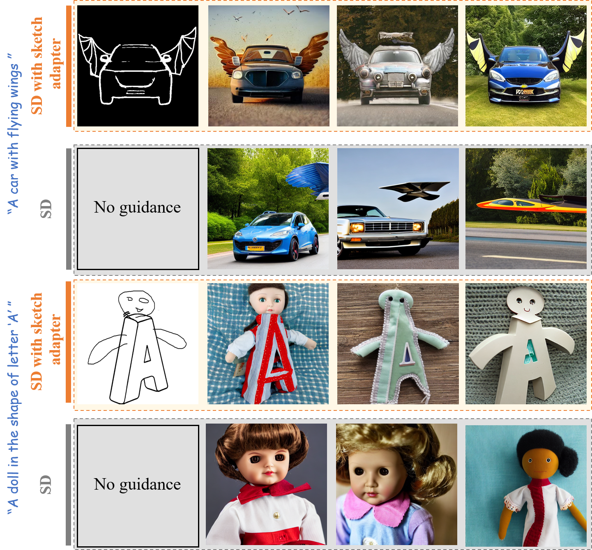
</p>

### Sequential editing with the sketch adapter

We can realize the sequential editing with the adapter guidance.

<p align="center">
  
</p>

### Composable Guidance with multiple adapters

Stable Diffusion results guided with the segmentation and sketch adapters together.

<p align="center">
  
</p>

## 🤗 Acknowledgements
Thank haofanwang for providing a tutorial of [T2I-Adapter diffusers](https://github.com/haofanwang/T2I-Adapter-for-Diffusers). 


Logo materials: [adapter](https://www.flaticon.com/free-icon/adapter_4777242), [lightbulb](https://www.flaticon.com/free-icon/lightbulb_3176369)
