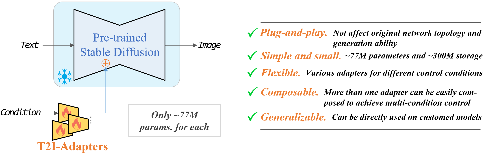
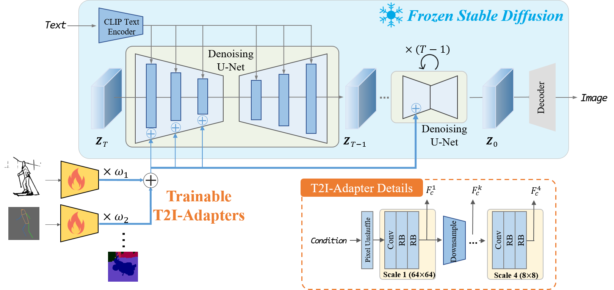

<p align="center">
  
</p>

<div align="center">

 💥**T2I-Adapter-SDXL:**[](https://github.com/TencentARC/T2I-Adapter/tree/XL)
**|** **CoAdapter:**[](https://huggingface.co/spaces/Adapter/CoAdapter) **|** **T2I-Adapter:**[](https://huggingface.co/spaces/Adapter/T2I-Adapter) 

 🎨[**Demos**](docs/examples.md) **|** ⏬[**Download Models**](#-download-models) **|** 💻[**How to Test**](#-how-to-test) **|** 🏰[**Adapter Zoo**](docs/AdapterZoo.md)
</div>

Official implementation of **[T2I-Adapter: Learning Adapters to Dig out More Controllable Ability for Text-to-Image Diffusion Models](https://arxiv.org/abs/2302.08453)**.

---

</div>

### 🚩 **New Features/Updates**
- ✅ Aug. 21, 2023. We release [T2I-Adapter-SDXL](https://github.com/TencentARC/T2I-Adapter/tree/XL), including sketch, canny, and keypoint. We still use the original recipe (77M parameters, a single inference) to drive [StableDiffusion-XL](https://huggingface.co/stabilityai/stable-diffusion-xl-base-1.0). Due to the limited computing resources, those adapters still need further improvement. We are collaborating with [HuggingFace](https://huggingface.co/), and a more powerful adapter is in the works.

- ✅ Jul. 13, 2023. [Stability AI](https://stability.ai/) release [Stable Doodle](https://stability.ai/blog/clipdrop-launches-stable-doodle), a groundbreaking sketch-to-image tool based on T2I-Adapter and [SDXL](https://huggingface.co/stabilityai/stable-diffusion-xl-base-0.9). It makes drawing easier.

https://user-images.githubusercontent.com/73707470/253800159-c7e12362-1ea1-4b20-a44e-bd6c8d546765.mp4

- ✅ Mar. 16, 2023. We add **CoAdapter** (**Co**mposable **Adapter**). The online Huggingface Gadio has been updated [](https://huggingface.co/spaces/Adapter/CoAdapter). You can also try the [local gradio demo](app_coadapter.py).
- ✅ Mar. 16, 2023. We have shrunk the git repo with [bfg](https://rtyley.github.io/bfg-repo-cleaner/).  If you encounter any issues when pulling or pushing, you can try re-cloning the repository. Sorry for the inconvenience.
- ✅ Mar. 3, 2023. Add a [*color adapter (spatial palette)*](https://huggingface.co/TencentARC/T2I-Adapter/tree/main/models), which has only **17M parameters**.
- ✅ Mar. 3, 2023. Add four new adapters [*style, color, openpose and canny*](https://huggingface.co/TencentARC/T2I-Adapter/tree/main/models). See more info in the **[Adapter Zoo](docs/AdapterZoo.md)**.
- ✅ Feb. 23, 2023. Add the depth adapter [*t2iadapter_depth_sd14v1.pth*](https://huggingface.co/TencentARC/T2I-Adapter/tree/main/models). See more info in the **[Adapter Zoo](docs/AdapterZoo.md)**.
- ✅ Feb. 15, 2023. Release T2I-Adapter.

---
<div align="center">

  🔥🔥🔥 Support **CoAdapter** (**Co**mposable **Adapter**). <br>You can find the details and demos about CoAdapter from [coadapter.md](docs/coadapter.md)

  <!-- Try the updated Huggingface demo  [](https://huggingface.co/spaces/Adapter/T2I-Adapter). -->

</div>

---
# Introduction
<p align="center">
  
</p>

We propose T2I-Adapter, a **simple and small (~70M parameters, ~300M storage space)** network that can provide extra guidance to pre-trained text-to-image models while **freezing** the original large text-to-image models.

T2I-Adapter aligns internal knowledge in T2I models with external control signals.
We can train various adapters according to different conditions, and achieve rich control and editing effects.

<!-- <p align="center">
  
</p> -->

# ⏬ Download Models

Put the downloaded models in the `T2I-Adapter/models` folder.

1. You can find the pretrained **T2I-Adapters**, **CoAdapters**, and third party models from <https://huggingface.co/TencentARC/T2I-Adapter>.
2. A base SD model is still needed to inference. We recommend to use **Stable Diffusion v1.5**. But please note that the adapters should work well on other SD models which are finetuned from SD-V1.4 or SD-V1.5. You can download these models from HuggingFace or civitai, all the following tested models (e.g., Anything anime model) can be found in there.
3. [Optional] If you want to use mmpose adapter, you need to download the pretrained keypose detection models include [FasterRCNN (human detection)](https://download.openmmlab.com/mmdetection/v2.0/faster_rcnn/faster_rcnn_r50_fpn_1x_coco/faster_rcnn_r50_fpn_1x_coco_20200130-047c8118.pth) and [HRNet (pose detection)](https://download.openmmlab.com/mmpose/top_down/hrnet/hrnet_w48_coco_256x192-b9e0b3ab_20200708.pth).


# 🔧 Dependencies and Installation

- Python >= 3.6 (Recommend to use [Anaconda](https://www.anaconda.com/download/#linux) or [Miniconda](https://docs.conda.io/en/latest/miniconda.html))
- [PyTorch >= 1.4](https://pytorch.org/)
```bash
pip install -r requirements.txt
```
- If you want to use the full function of keypose-guided generation, you need to install MMPose. For details please refer to <https://github.com/open-mmlab/mmpose>.

# 💻 How to Test

#### Download Examples (optional)
We provide some [example](https://huggingface.co/TencentARC/T2I-Adapter/tree/main/examples) inputs in huggingface, you can download these examples by:
```bash
python examples/download_examples.py
```

#### **🔥🔥🔥Gradio Demo for CoAdapter**
You need to download the pretrained CoAdapters from [huggingface](https://huggingface.co/TencentARC/T2I-Adapter) first, and put them in the `models` folder
```bash
# test for stable diffusion v1.5
python app_coadapter.py --sd_ckpt models/v1-5-pruned-emaonly.ckpt
```

<!-- <div align="center"> -->
<p align="center">
  


  
  <!--  -->
  <!-- You can find more examples [here](docs/examples.md) -->
</p>

#### **Gradio Demo for T2I-Adapters**
```bash
# test for stable diffusion v1.5
python app.py --sd_ckpt models/v1-5-pruned-emaonly.ckpt
# test for other stable diffusion model, like Anything 4.5
python app.py --sd_ckpt models/anything-v4.5-pruned-fp16.ckpt --vae_ckpt models/anything-v4.0.vae.pt
```

#### **Spatial Palette (Color) Adapter**
```bash
# when input color image
python test_adapter.py --which_cond color --cond_path examples/color/color_0002.png --cond_inp_type color --prompt "A photo of scenery" --sd_ckpt models/v1-5-pruned-emaonly.ckpt --resize_short_edge 512 --cond_tau 1.0 --cond_weight 1.0 --n_samples 2 --adapter_ckpt models/t2iadapter_color_sd14v1.pth --scale 9
# when input non-color image, obtain the color image is also straightforward, just bicubic downsample to low res and nearst upsample normal res
python test_adapter.py --which_cond color --cond_path examples/sketch/scenery.jpg --cond_inp_type image --prompt "A photo of scenery" --sd_ckpt models/v1-5-pruned-emaonly.ckpt --resize_short_edge 512 --cond_tau 1.0 --cond_weight 1.0 --n_samples 2 --adapter_ckpt models/t2iadapter_color_sd14v1.pth --scale 9
```
[](https://huggingface.co/spaces/Adapter/T2I-Adapter)
<p align="center">
  
</p>


#### **Depth Adapter**
```bash
# when input non-depth image
python test_adapter.py --which_cond depth --cond_path examples/depth/sd.png --cond_inp_type image --prompt "Stormtrooper's lecture, best quality, extremely detailed" --sd_ckpt models/v1-5-pruned-emaonly.ckpt --resize_short_edge 512 --cond_tau 1.0 --cond_weight 1.0 --n_samples 2 --adapter_ckpt models/t2iadapter_depth_sd14v1.pth
# when input depth image
python test_adapter.py --which_cond depth --cond_path examples/depth/desk_depth.png --cond_inp_type depth --prompt "desk, best quality, extremely detailed" --sd_ckpt models/v1-5-pruned-emaonly.ckpt --resize_short_edge 512 --cond_tau 1.0 --cond_weight 1.0 --n_samples 2 --adapter_ckpt models/t2iadapter_depth_sd14v1.pth
```
[](https://huggingface.co/spaces/Adapter/T2I-Adapter)
<p align="center">
  
</p>

#### **Canny Adapter**
```bash
# when input canny image
python python test_adapter.py --which_cond canny --cond_path examples/canny/toy_canny.png --cond_inp_type canny --prompt "Cute toy, best quality, extremely detailed" --sd_ckpt models/anything-v4.5-pruned-fp16.ckpt --vae_ckpt models/anything-v4.0.vae.pt --resize_short_edge 512 --cond_tau 1.0 --cond_weight 1.0 --n_samples 2 --adapter_ckpt models/t2iadapter_canny_sd14v1.pth
# when input non-canny image
python python test_adapter.py --which_cond canny --cond_path examples/canny/rabbit.png --cond_inp_type image --prompt "A rabbit, best quality, extremely detailed" --sd_ckpt models/sd-v1-4.ckpt --resize_short_edge 512 --cond_tau 1.0 --cond_weight 1.0 --n_samples 2 --adapter_ckpt models/t2iadapter_canny_sd14v1.pth
```
[](https://huggingface.co/spaces/Adapter/T2I-Adapter)

<p align="center">
  
</p>

#### **Sketch Adapter**
```bash
# when input sketch image
python test_adapter.py --which_cond sketch --cond_path examples/sketch/car.png --cond_inp_type sketch --prompt "A car with flying wings" --sd_ckpt models/sd-v1-4.ckpt --resize_short_edge 512 --cond_tau 0.5 --cond_weight 1.0 --n_samples 2 --adapter_ckpt models/t2iadapter_sketch_sd14v1.pth
# when input non-sketch image
python test_adapter.py --which_cond sketch --cond_path examples/sketch/girl.jpeg --cond_inp_type image --prompt "1girl, masterpiece, high-quality, high-res" --sd_ckpt models/anything-v4.5-pruned-fp16.ckpt --vae_ckpt models/anything-v4.0.vae.pt --resize_short_edge 512 --cond_tau 1.0 --cond_weight 1.0 --n_samples 2 --adapter_ckpt models/t2iadapter_sketch_sd14v1.pth
```

[](https://huggingface.co/spaces/Adapter/T2I-Adapter)
<p align="center">
  
</p>

<p align="center">
  
</p>


#### **OpenPose Adapter**
```bash
# when input non-pose image
python test_adapter.py --which_cond openpose --cond_path examples/openpose/iron_man_image.png --cond_inp_type image --prompt "Iron man, high-quality, high-res" --sd_ckpt models/sd-v1-5.ckpt --resize_short_edge 512 --cond_tau 1.0 --cond_weight 1.0 --n_samples 1 --adapter_ckpt models/t2iadapter_openpose_sd14v1.pth
# when input openpose image
python test_adapter.py --which_cond openpose --cond_path examples/openpose/iron_man_pose.png --cond_inp_type openpose --prompt "Iron man, high-quality, high-res" --sd_ckpt models/anything-v4.5-pruned-fp16.ckpt --vae_ckpt models/anything-v4.0.vae.pt --resize_short_edge 512 --cond_tau 1.0 --cond_weight 1.0 --n_samples 1 --adapter_ckpt models/t2iadapter_openpose_sd14v1.pth
```

[](https://huggingface.co/spaces/Adapter/T2I-Adapter)
<p align="center">
  
</p>


#### **Keypose Adapter**
```bash
# when input non-pose image
python test_adapter.py --which_cond keypose --cond_path examples/sketch/girl.jpeg --cond_inp_type image --prompt "1girl, masterpiece, high-quality, high-res" --sd_ckpt models/anything-v4.5-pruned-fp16.ckpt --vae_ckpt models/anything-v4.0.vae.pt --resize_short_edge 512 --cond_tau 1.0 --cond_weight 1.0 --n_samples 1 --adapter_ckpt models/t2iadapter_keypose_sd14v1.pth

# when input pose image
python test_adapter.py --which_cond keypose --cond_path examples/keypose/person_keypose.png --cond_inp_type keypose --prompt "astronaut, best quality, extremely detailed" --sd_ckpt models/v1-5-pruned-emaonly.ckpt --resize_short_edge 512 --cond_tau 1.0 --cond_weight 1.0 --n_samples 2 --adapter_ckpt models/t2iadapter_keypose_sd14v1.pth
```

[](https://huggingface.co/spaces/Adapter/T2I-Adapter)
<p align="center">
  
</p>


#### **Segmentation Adapter**
```bash
# currently, only seg input is supported, if you need image as input, please let us know
python test_adapter.py --which_cond seg --cond_path examples/seg/motor.png --cond_inp_type seg --prompt "A black Honda motorcycle parked in front of a garage, best quality, extremely detailed" --sd_ckpt models/v1-5-pruned-emaonly.ckpt --resize_short_edge 512 --cond_tau 1.0 --cond_weight 1.0 --n_samples 2 --adapter_ckpt models/t2iadapter_seg_sd14v1.pth
```

[](https://huggingface.co/spaces/Adapter/T2I-Adapter)
<p align="center">
  
</p>

#### **Combine multiple Adapters**
```bash
# test depth + keypose
python test_composable_adapters.py --prompt "1girl, computer desk, red chair best quality, extremely detailed" --depth_path examples/depth/desk_depth.png --depth_weight 1.0 --depth_adapter_ckpt experiments/train_depth/models/model_ad_70000.pth --depth_inp_type depth --keypose_path examples/keypose/person_keypose.png --keypose_inp_type keypose --keypose_adapter_ckpt models/t2iadapter_keypose_sd14v1.pth --keypose_weight 1.5 --cond_tau 0.7 --sd_ckpt models/anything-v4.5-pruned-fp16.ckpt --vae_ckpt models/anything-v4.0.vae.pt --n_sample 8 --max_resolution 524288
# test color + sketch
python test_composable_adapters.py --prompt "A farm, best quality, extremely detailed" --sketch_path examples/sketch/scenery.jpg --sketch_weight 1.0 --sketch_adapter_ckpt models/t2iadapter_sketch_sd14v1.pth --sketch_inp_type image --color_path examples/color/color_0001.png --color_inp_type image --color_adapter_ckpt models/t2iadapter_color_sd14v1.pth --color_weight 1.2 --cond_tau 1.0 --sd_ckpt models/v1-5-pruned-emaonly.ckpt --n_sample 1 --resize_short_edge 512
# test sketch + style
python test_composable_adapters.py --prompt "car" --sketch_path examples/sketch/car.png --sketch_weight 1.0 --sketch_adapter_ckpt models/t2iadapter_sketch_sd14v1.pth --sketch_inp_type image --style_path examples/style/cyberpunk.png --style_inp_type image --style_adapter_ckpt models/t2iadapter_style_sd14v1.pth --cond_tau 1.0 --sd_ckpt models/v1-5-pruned-emaonly.ckpt --n_sample 1 --resize_short_edge 512 --scale 9
```
[](https://huggingface.co/spaces/ChongMou/T2I-Adapter)
<p align="center">
  
</p>

[](https://huggingface.co/spaces/Adapter/T2I-Adapter)
<p align="center">
  
</p>

[](https://huggingface.co/spaces/Adapter/T2I-Adapter)
<p align="center">
  
</p>


## Stable Diffusion + T2I-Adapters (only ~70M parameters, ~300M storage space)

The following is the detailed structure of a **Stable Diffusion** model with the **T2I-Adapter**.
<p align="center">
  
</p>

<!-- ## Web Demo

* All the usage of three T2I-Adapters (i.e, sketch, keypose and segmentation) are integrated into [Huggingface Spaces]() 🤗 using [Gradio](). Have fun with the Web Demo.  -->

# 🚀 Interesting Applications

### Stable Diffusion results guided with the sketch T2I-Adapter

The corresponding edge maps are predicted by PiDiNet. The sketch T2I-Adapter can well generalize to other similar sketch types, for example, sketches from the Internet and user scribbles.

<p align="center">
  
</p>

### Stable Diffusion results guided with the keypose T2I-Adapter

The keypose results predicted by the [MMPose](https://github.com/open-mmlab/mmpose).
With the keypose guidance, the keypose T2I-Adapter can also help to generate animals with the same keypose, for example, pandas and tigers.

<p align="center">
  
</p>

### T2I-Adapter with Anything-v4.0

Once the T2I-Adapter is trained, it can act as a **plug-and-play module** and can be seamlessly integrated into the finetuned diffusion models **without re-training**, for example, Anything-4.0.

#### ✨ Anything results with the plug-and-play sketch T2I-Adapter (no extra training)

<p align="center">
  
</p>

#### Anything results with the plug-and-play keypose T2I-Adapter (no extra training)

<p align="center">
  
</p>

### Local editing with the sketch adapter

When combined with the inpaiting mode of Stable Diffusion, we can realize local editing with user specific guidance.

#### ✨ Change the head direction of the cat

<p align="center">
  
</p>

#### ✨ Add rabbit ears on the head of the Iron Man.

<p align="center">
  
</p>

### Combine different concepts with adapter

Adapter can be used to enhance the SD ability to combine different concepts.

####  ✨ A car with flying wings. / A doll in the shape of letter ‘A’.

<p align="center">
  
</p>

### Sequential editing with the sketch adapter

We can realize the sequential editing with the adapter guidance.

<p align="center">
  
</p>

### Composable Guidance with multiple adapters

Stable Diffusion results guided with the segmentation and sketch adapters together.

<p align="center">
  
</p>

### Cooperating with Low-Rank Adapters for Controllable Multi-Concept Generation
[Mix-of-Show](https://github.com/TencentARC/Mix-of-Show) designed by [Yuchao Gu](https://ycgu.site/), et al.

<p align="center">
  
</p>


# 🤗 Acknowledgements
Thank haofanwang for providing a tutorial of [T2I-Adapter diffusers](https://github.com/haofanwang/T2I-Adapter-for-Diffusers).


Logo materials: [adapter](https://www.flaticon.com/free-icon/adapter_4777242), [lightbulb](https://www.flaticon.com/free-icon/lightbulb_3176369)
