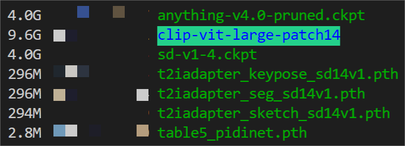

<p align="center">
  
</p>

<div align="center">

⏬[**Download Models**](#-download-models) **|** 💻[**How to Test**](#-how-to-test) **|** 💥 [](https://huggingface.co/spaces/ChongMou/T2I-Adapter)

</div>

Official implementation of T2I-Adapter: Learning Adapters to Dig out More Controllable Ability for Text-to-Image Diffusion Models.

#### [Paper](https://arxiv.org/abs/2302.08453)

<p align="center">
  
</p>

We propose T2I-Adapter, a **simple and small (~70M parameters, ~300M storage space)** network that can provide extra guidance to pre-trained text-to-image models while **freezing** the original large text-to-image models.

T2I-Adapter aligns internal knowledge in T2I models with external control signals.
We can train various adapters according to different conditions, and achieve rich control and editing effects.

<p align="center">
  
</p>

### ⏬ Download Models

Put the downloaded models in the `T2I-Adapter/models` folder.

1. The **T2I-Adapters** can be download from <https://huggingface.co/TencentARC/T2I-Adapter>.
2. The pretrained **Stable Diffusion v1.4** models can be download from <https://huggingface.co/CompVis/stable-diffusion-v-1-4-original/tree/main>. You need to download the `sd-v1-4.ckpt
` file.
3. [Optional] If you want to use **Anything v4.0** models, you can download the pretrained models from <https://huggingface.co/andite/anything-v4.0/tree/main>. You need to download the `anything-v4.0-pruned.ckpt` file.
4. The pretrained **clip-vit-large-patch14** folder can be download from <https://huggingface.co/openai/clip-vit-large-patch14/tree/main>. Remember to download the whole folder!
5. The pretrained keypose detection models include FasterRCNN (human detection) from <https://download.openmmlab.com/mmdetection/v2.0/faster_rcnn/faster_rcnn_r50_fpn_1x_coco/faster_rcnn_r50_fpn_1x_coco_20200130-047c8118.pth> and HRNet (pose detection) from <https://download.openmmlab.com/mmpose/top_down/hrnet/hrnet_w48_coco_256x192-b9e0b3ab_20200708.pth>.

After downloading, the folder structure should be like this:

<p align="center">
  
</p>

### 🔧 Dependencies and Installation

- Python >= 3.6 (Recommend to use [Anaconda](https://www.anaconda.com/download/#linux) or [Miniconda](https://docs.conda.io/en/latest/miniconda.html))
- [PyTorch >= 1.4](https://pytorch.org/)
```bash
pip install -r requirements.txt
```
- If you want to use the full function of keypose-guided generation, you need to install MMPose. For details please refer to <https://github.com/open-mmlab/mmpose>.

### 💻 How to Test

[//]: # (#### **Gradio Application**)

[//]: # ()
[//]: # (> python app.py)

#### **Sketch Adapter**

- Sketch to Image Generation

> python test_sketch.py --prompt "A car with flying wings" --path_cond examples/sketch/car.png --ckpt models/sd-v1-4.ckpt --type_in sketch

- Image to Sketch to Image Generation

> python test_sketch.py --prompt "A beautiful girl" --path_cond examples/sketch/human.png --ckpt models/sd-v1-4.ckpt --type_in image

- The adaptor is training based on stable-diffusion-v1.4 but can be generalized to other models, such as Anything-v4 which is an anime diffusion model

> python test_sketch.py --prompt "1girl, masterpiece, high-quality, high-res" --path_cond examples/anything_sketch/human.png --ckpt models/anything-v4.0-pruned.ckpt --ckpt_vae models/anything-v4.0.vae.pt --type_in image


#### **Keypose Adapter**

- Keypose to Image Generation

> python test_keypose.py --prompt "A beautiful girl" --path_cond examples/keypose/iron.png --type_in pose

- Image to Image Generation

> python test_keypose.py --prompt "A beautiful girl" --path_cond examples/sketch/human.png --type_in image

- Generation anime image with Anything-v4 model

> python test_keypose.py --prompt "A beautiful girl" --path_cond examples/sketch/human.png --ckpt models/anything-v4.0-pruned.ckpt --ckpt_vae models/anything-v4.0.vae.pt --type_in image


#### **Segmentation Adapter**

> python test_seg.py --prompt "A black Honda motorcycle parked in front of a garage" --path_cond examples/seg/motor.png

#### **Combine multiple Adapters**

> python test_composable_adapters.py --prompt "An all white kitchen with an electric stovetop" --seg_cond_path examples/seg_sketch/mask.png --sketch_cond_path examples/seg_sketch/edge.png --sketch_cond_weight 0.5

#### **Local editing with adapters**

> python test_sketch_edit.py --prompt "A white cat" --path_cond examples/edit_cat/edge_2.png --path_x0 examples/edit_cat/im.png --path_mask examples/edit_cat/mask.png

## Stable Diffusion + T2I-Adapters (only ~70M parameters, ~300M storage space)

The following is the detailed structure of a **Stable Diffusion** model with the **T2I-Adapter**.
<p align="center">
  
</p>

<!-- ## Web Demo

* All the usage of three T2I-Adapters (i.e, sketch, keypose and segmentation) are integrated into [Huggingface Spaces]() 🤗 using [Gradio](). Have fun with the Web Demo.  -->

## 🚀 Interesting Applications

### Stable Diffusion results guided with the sketch T2I-Adapter

The corresponding edge maps are predicted by PiDiNet. The sketch T2I-Adapter can well generalize to other similar sketch types, for example, sketches from the Internet and user scribbles.

<p align="center">
  
</p>

### Stable Diffusion results guided with the keypose T2I-Adapter

The keypose results predicted by the [MMPose](https://github.com/open-mmlab/mmpose).
With the keypose guidance, the keypose T2I-Adapter can also help to generate animals with the same keypose, for example, pandas and tigers.

<p align="center">
  
</p>

### T2I-Adapter with Anything-v4.0

Once the T2I-Adapter is trained, it can act as a **plug-and-play module** and can be seamlessly integrated into the finetuned diffusion models **without re-training**, for example, Anything-4.0.

#### ✨ Anything results with the plug-and-play sketch T2I-Adapter (no extra training)

<p align="center">
  
</p>

#### Anything results with the plug-and-play keypose T2I-Adapter (no extra training)

<p align="center">
  
</p>

### Local editing with the sketch adapter

When combined with the inpaiting mode of Stable Diffusion, we can realize local editing with user specific guidance.

#### ✨ Change the head direction of the cat

<p align="center">
  
</p>

#### ✨ Add rabbit ears on the head of the Iron Man.

<p align="center">
  
</p>

### Combine different concepts with adapter

Adapter can be used to enhance the SD ability to combine different concepts.

####  ✨ A car with flying wings. / A doll in the shape of letter ‘A’.

<p align="center">
  
</p>

### Sequential editing with the sketch adapter

We can realize the sequential editing with the adapter guidance.

<p align="center">
  
</p>

### Composable Guidance with multiple adapters

Stable Diffusion results guided with the segmentation and sketch adapters together.

<p align="center">
  
</p>


Logo materials: [adapter](https://www.flaticon.com/free-icon/adapter_4777242), [lightbulb](https://www.flaticon.com/free-icon/lightbulb_3176369)
